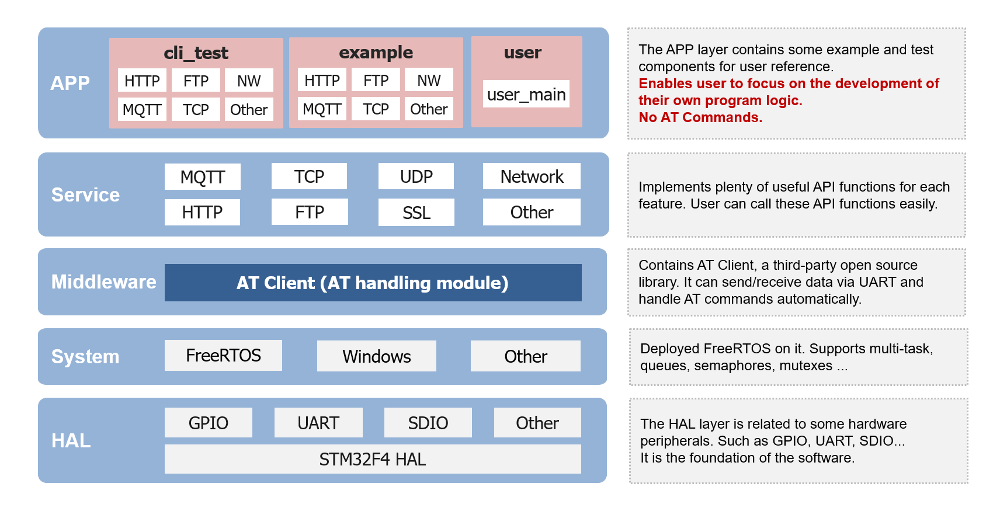
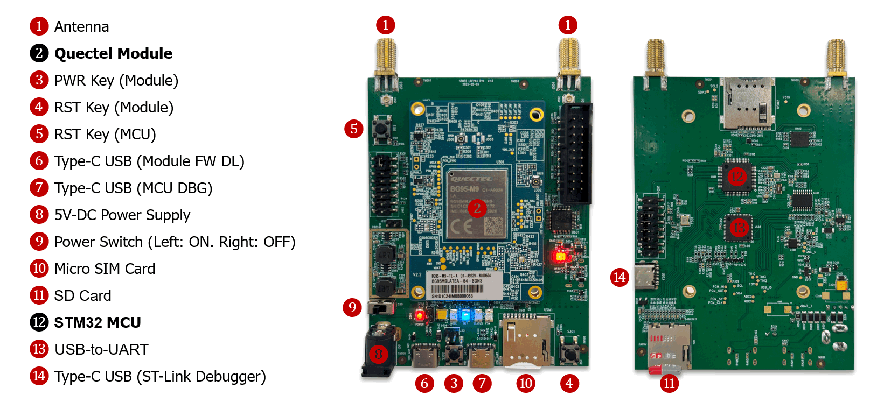

  

    Build a smarter world

  <b>English</b> | <a href="./docs/README_zh.md">中文</a>

# Quectel User-Friendly SDK

## Overview
Quectel User-Friendly Project, is a software framework specifically designed for developers. Within this framework, developers can directly call APIs to implement various functionalities without dealing with complex AT data interactions between MCU and modules. This approach has addressed the pain points of traditional AT command development methods, and it can make Quectel module development simpler and more user-friendly.

**`By importing this project, you gain:`**

#### Simplified Development Approach
Implement functionalities through API function calls, eliminating complex traditional AT commands

#### Shorter Learning Curve
No need to learn and master AT commands, or even refer to AT manuals, reducing development investment

#### Faster Time-to-Market
Accelerate development cycles. Reduce the time required to launch new products and solutions, and seize more market opportunities

 

## Key Features
- Support calling API functions to control the wireless module, without learning AT commands
- Support automatic handling of AT commands and data interaction, and also has URC and exception handling capabilities
- Support for various practical functionalities including HTTP/FTP/TCP/UDP/MQTT, etc
- Support for multiple mainstream STM32 MCU models such as F1/F3/F4, with extensibility
- Support FreeRTOS
- Support Windows/Linux development environment, with built-in cross-compilation toolchain, ready to use out-of-the-box
- Support one-click automated generation of MCU parameters, CMakeLists.txt, and other key files without manual configuration
- Support Complete build, compilation, download, and debugging capabilities without dependency on Keil/IAR IDEs
- Support for both CLI and GUI development approaches using command line and VSCode respectively

 

## Software Architecture

  

## Directory Structure

    ├── 📁 .vscode              # VSCode debugging environment configuration (optional)
    ├── 📁 apps                 # Application programs, including functional examples and tests
    ├── 📁 build                # Build output directory containing build artifacts
    ├── 📁 quectel              # Quectel code adaptation directory
    ├── 📁 system               # System platform adaptation, including OS and MCU driver code
    ├── 📁 tools                # Toolkit containing cross-compilation toolchain, scripts, configurations
    ├── 📄 .clang-format        # Clang code style specification file
    ├── 📄 .editorconfig        # Cross-editor format configuration file
    ├── 📄 .gitignore           # Git version control ignore rules
    ├── 📄 build.bat            # Windows script for build, compile, download, debug commands
    ├── 📄 build.sh             # Linux script for build, compile, download, debug commands
    ├── 📄 CMakeLists.txt       # Main CMake project build configuration
    └── 📄 CMakePresets.json    # CMake project build preset parameters

 

## Quick Start
### Hardware Environment
The most convenient method is using the QSTM32-L064M-SL-EVB development board for validation, which features onboard STM32 MCU, Quectel module, ST-Link debugger, and USB-to-UART tool. For detailed description, refer to [STM32_LQFP64_EVK_V2.0_User_Guide](./docs/Quick_Start/STM32%20LQFP64%20EVK%20V2.0%20User%20Guide%20V1.0-0605.pdf)

  

### Host System
This SDK supports both Windows and Linux development environments with comprehensive automated scripts.
- For Windows environment, Windows 10 (64-bit) is recommended. ST-Link and CP210x driver installation methods are detailed in [Quectel_QSTM32_SDK_Quick_Start_Guide](./docs/Quick_Start/Quectel_QSTM32_SDK_Quick_Start_Guide_V2.0.pdf)
- For Linux environment, Ubuntu 18.04/20.04/22.04 and Debian-based distributions are supported. The build.sh script is theoretically compatible with other distributions, though command modifications may be required. For ST-Link and CP210x drivers, most modern Linux distributions include them in the kernel and typically don't require manual installation. Additionally, Python3 needs to be installed in advance.

### Software Deployment
Clone this project SDK using git:

    git clone https://github.com/quectel-develop/user-friendly-project.git

A complete cross-compilation toolchain is provided in the [source/tools](./source/tools/) directory, requiring no additional software development environment setup - ready to use out-of-the-box.

### Build Commands:
Use build.bat for Windows development environment and build.sh for Linux environment.

**`For Windows environment, use the following commands:`**

    .\build.bat config      # Configure build system
    .\build.bat all         # Compile project
    .\build.bat clean       # Clean build artifacts
    .\build.bat download    # Download firmware
    .\build.bat debug       # Start debugging session

**`For Linux environment, use the following commands:`**

    ./build.sh config      # Configure build system
    ./build.sh all         # Compile project
    ./build.sh clean       # Clean build artifacts
    ./build.sh download    # Download firmware
    ./build.sh debug       # Start debugging session

Note: If USB permission issues occur, use sudo, e.g., **`sudo ./build.sh download`**

#### Parameter Description:
    The build.bat config command can be followed by [MCU Model][Version Number] parameters, for example:
    build.bat config STM32F413RGT6 your_firmware_version

    If [MCU Model][Version Number] parameters are omitted, the previously configured MCU model and version number are used.
    For first-time use without previous configuration records, the MCU defaults to STM32F413RGT6 and version number uses Quectel_UFP_Chip_Date format, e.g., Quectel_UFP_STM32F413RGT6_20250430

 

## Documentation
For detailed Quick Start instructions and other Application Notes, please refer to documents in the [docs](./docs/) directory.

## License
This project is licensed under the Apache-2.0 license. See [LICENSE](./LICENSE) for details.