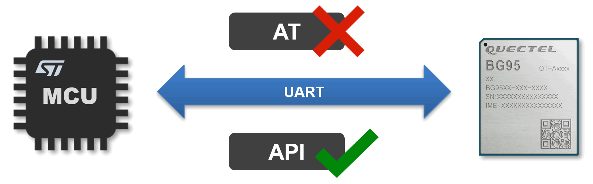

  

  
Build a smarter world

  <a href="./README.md">English</a> | <b>中文</b>

# Quectel User-Friendly SDK

## 项目简介
Quectel User-Friendly Project，是移远通信专门为开发者设计的一套软件框架，在该框架下可直接调用API
来实现各种功能，开发者只需专注于自己的业务逻辑，而无需处理MCU和模组之间复杂的AT数据交互，解决了传统AT命令开发方式的诸多痛点，从而使移远模组的开发更加简单、友好。

### **`通过导入这个项目，你将获得：`**

- #### 更简单的开发方式
  通过调用API函数的方式实现各种功能，摒弃了复杂的传统AT命令

- #### 更短的学习曲线
  不必学习和掌握AT命令，甚至可以扔掉AT手册， 减少开发投入

- #### 更快的量产速度
  可加速开发周期，缩短新项目落地所需的时间，以赢取更多的市场机会

 

  

 

## 主要特性
- 支持调用API函数控制无线模组，无需学习如何使用AT命令
- 支持自动处理AT命令和数据交互，同时具备URC和异常处理能力
- 支持 HTTP/FTP/TCP/UDP/MQTT 等多种实用功能
- 支持 STM32 单片机多款主流型号，如 F1/F3/F4 等，并具备可扩展性
- 支持 FreeRTOS 实时操作系统
- 支持 Windows/Linux 开发环境，且SDK内置交叉编译工具链，开箱即用
- 支持 MCU相关参数、CMakeLists.txt等关键文件一键自动化生成，无需手动配置
- 支持完整的构建、编译、下载、调试等功能，SDK开发不依赖 Keil/IAR 等IDE
- 支持 CLI 和 GUI 两种开发方式，CLI使用命令行，GUI使用VSCode

 

## 软件架构

  

 

## 目录结构

    ├── 📁 .vscode              # VSCode调试环境配置（可选）
    ├── 📁 apps                 # 应用程序，包含各功能example和test
    ├── 📁 build                # 构建输出，包含构建产物
    ├── 📁 quectel              # Quectel代码适配目录
    ├── 📁 system               # 系统平台适配，包含OS和各型号MCU驱动代码
    ├── 📁 tools                # 工具包，包含交叉编译工具链、脚本、配置等
    ├── 📄 .clang-format        # Clang代码风格规范文件
    ├── 📄 .editorconfig        # 跨编辑器格式统一配置文件
    ├── 📄 .gitignore           # Git版本控制忽略规则
    ├── 📄 build.bat            # Windows脚本，执行构建、编译、下载、调试等命令
    ├── 📄 build.sh             # Linux脚本，执行构建、编译、下载、调试等命令
    ├── 📄 CMakeLists.txt       # CMake项目构建主配置
    └── 📄 CMakePresets.json    # CMake项目构建预设参数

 

## 快速开始
### 硬件环境
最方便的方法是使用 QSTM32-L064M-SL-EVB 开发板进行验证，其板载STM32单片机、Quectel模组、ST-Link调试器和USB-to-UART工具，详细描述可参考 [STM32_LQFP64_EVK_V2.0_User_Guide](./docs/Quick_Start/STM32%20LQFP64%20EVK%20V2.0%20User%20Guide%20V1.0-0605.pdf)

  

### 主机系统
本SDK支持Windows和Linux开发环境，均已开发了完善的自动化脚本。
- 对于Windows环境，推荐使用 Windows 10(64-bit)。ST-Link 和 CP210x 的驱动安装方法详见 [Quectel_QSTM32_SDK_Quick_Start_Guide](./docs/Quick_Start/Quectel_QSTM32_SDK_Quick_Start_Guide_V2.0.pdf)
- 对于Linux环境，支持 Ubuntu 18.04/20.04/22.04, 基于Debian的Linux发行版，build.sh脚本理论上都兼容，其他发行版需要对脚本中的命令做相应修改。对于ST-Link 和 CP210x驱动，大多数现代Linux发行版在内核中已集成，通常无需手动安装。另外，也需要提前安装python3。

### 软件部署
可使用git工具克隆本项目SDK：

    git clone https://github.com/quectel-develop/user-friendly-project.git

在 [source/tools](./source/tools/) 目录中已提供了完整的交叉编译工具链，故无需搭建软件开发环境，开箱即用。

### 编译命令：
Windows 开发环境使用 build.bat，Linux 开发环境使用 build.sh。

**`如果你使用的是 Windows, 需要用以下命令：`**

    .\build.bat config      # 构建系统
    .\build.bat all         # 编译
    .\build.bat clean       # 清理
    .\build.bat download    # 下载
    .\build.bat debug       # 调试

**`如果你使用的是 Linux, 需要用以下命令：`**

    ./build.sh config      # 构建系统
    ./build.sh all         # 编译
    ./build.sh clean       # 清理
    ./build.sh download    # 下载
    ./build.sh debug       # 调试

注：如果提示USB权限问题，可使用sudo，例如 **`sudo ./build.sh download`**

#### 参数说明：
    build.bat config 命令后面可带 [芯片型号][版本号] 两个参数，例如：
    build.bat config STM32F413RGT6 your_firmware_version

    [芯片型号][版本号] 两个参数缺省的情况下，使用上次配置的芯片型号和版本号。
    若首次使用无先前配置记录，则芯片默认使用STM32F413RGT6，版本号默认使用格式Quectel_UFP_Chip_Date，例如Quectel_UFP_STM32F413RGT6_20250430

 

## 参考文档
对于 Quick Start 的详细说明，以及其他 Application Note，请参考 [docs](./docs/) 目录下的文档。

## 许可证
本项目遵循 Apache-2.0 许可证，详见 [LICENSE](./LICENSE)
